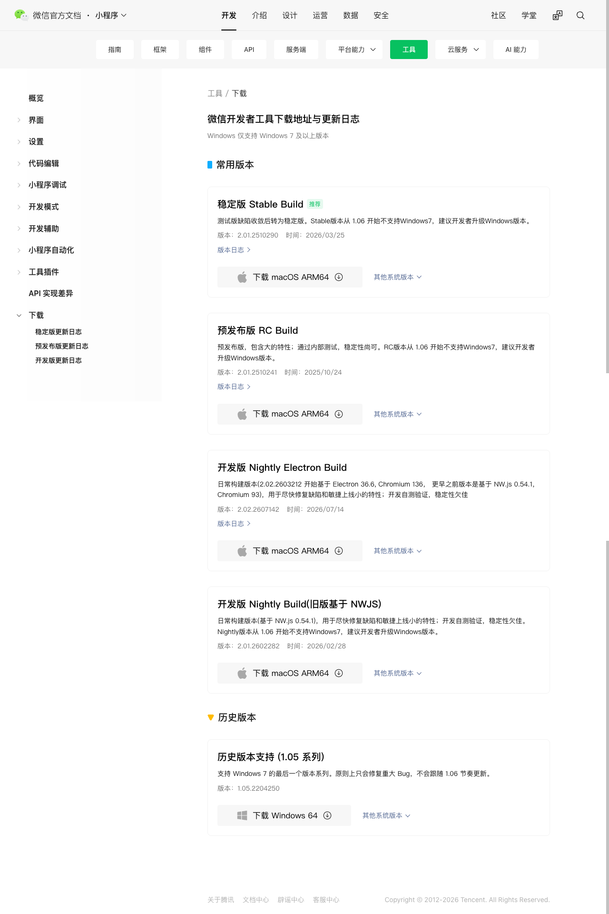
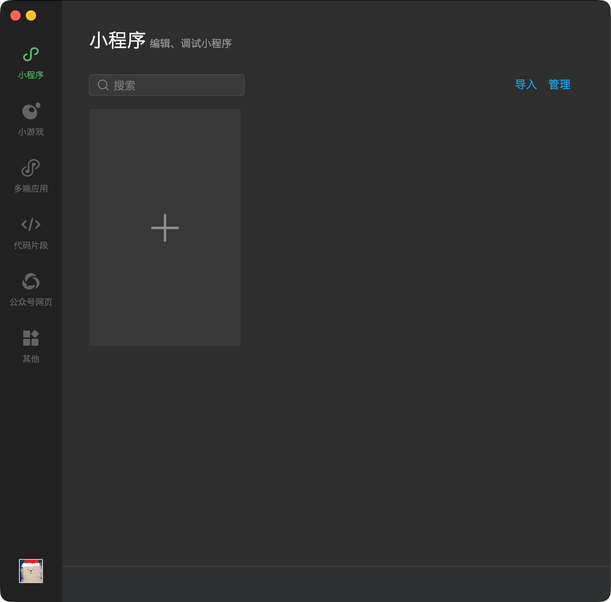

# Vibe 学习记：小程序协作开发课前准备

> 请在 **[2026-07-15 18:30]** 前完成本清单，并提交课程群的信息收集表。

本节课我们会共同开发已有的微信小程序「Vibe 学习记」。你会领取一个有明确验收标准的功能需求，在自己的功能分支完成实现，并通过 Pull Request（PR）提交给老师 Review 和合并。

课堂的重点是 **Specs-driven 开发**：读清需求与验收标准、借助 AI 协作完成小步实现、在微信开发者工具中验证，再提交可审查的代码改动。你不需要在课前学完微信小程序 API，也不需要从零创建一个小程序。

## 你需要完成什么

- [ ] 前序课程使用过的 Git、Node.js、npm 和 GitHub CLI 在本机可用。
- [ ] 微信开发者工具已安装，并已使用自己的微信登录。
- [ ] 已提交课前信息表：微信号、GitHub 用户名。
- [ ] 收到微信小程序和 GitHub 的邀请后，已分别接受。

## 1. 检查已有开发环境

本课程默认你已经完成前序的 Git / GitHub 环境准备；这里不重新讲安装过程，只确认工具仍然可用。

请确保本机已安装：

- Git
- Node.js（项目要求 Node.js 20、22 或 24 及以上版本，建议安装最新 LTS）
- npm（随 Node.js 一起安装）
- GitHub CLI（命令为 `gh`，用于确认 GitHub 登录状态）

如果缺少工具，请从官方渠道安装：

- [Git](https://git-scm.com/install)
- [Node.js](https://nodejs.org/en/download/)
- [GitHub CLI](https://cli.github.com/)

打开终端后运行以下命令。macOS Terminal、Windows PowerShell 和 Git Bash 都可以直接使用：

```bash
git --version
node --version
npm --version
gh --version
gh auth status
git config --global user.name
git config --global user.email
```

你应当看到：

- `git`、`node`、`npm`、`gh` 都能输出版本号；
- `gh auth status` 显示已登录自己的 GitHub 账号；
- Git 的 `user.name` 和 `user.email` 都不是空的。

如果 `gh auth status` 显示未登录，请运行：

```bash
gh auth login
gh auth setup-git
```

按提示使用浏览器登录自己的 GitHub 账号即可。不要把 GitHub 密码、验证码、Personal Access Token 或任何终端中的认证信息发到课程群或粘贴给 AI。

> 如果任意命令报错，请在课前联系老师，并附上操作系统、执行的命令和完整报错文字。请先遮住 Token、密码、验证码等敏感信息。

## 2. 安装并登录微信开发者工具

请从微信官方页面下载安装稳定版微信开发者工具：

- [微信开发者工具下载页](https://developers.weixin.qq.com/miniprogram/dev/devtools/download.html)

安装完成后，打开微信开发者工具，并使用自己的微信完成登录。请保持手机微信可用：登录开发者工具、接受小程序开发成员邀请，以及后续真机预览时都会用到它。

{ width=42% }

首次打开微信开发者工具时，请使用自己的手机微信扫描当次生成的登录二维码。二维码属于临时登录凭据，不要截图分享或提交到 Git 仓库。

{ width=56% }

请注意，课前**不要**自行进行以下操作：

- 不要创建空白小程序项目。
- 不要注册小程序主体、申请 AppID 或进行实名认证。
- 不要创建或支付 CloudBase / 云开发环境。
- 不要开启开发者工具「设置 → 安全」中的“服务端口”。
- 不要上传代码、提交审核或发布任何小程序版本。

课堂会使用老师已经创建的小程序、AppID 和云开发环境；学生只需要作为开发成员参与代码开发。

## 3. 提交课前信息表

请在表单中填写：

1. **微信号**：用于将你添加为本小程序的开发成员。
2. **GitHub 用户名**：用于将你添加为课程仓库的协作者。请填写个人主页地址中 `https://github.com/` 后面的用户名，而不是显示昵称、邮箱或密码。

## 4. 接受两类邀请

老师会根据表单信息发出两类邀请。请在收到后尽快接受；两类权限缺一不可。

### 微信小程序开发成员邀请

老师会使用你提交的微信号，把你加入「Vibe 学习记」小程序的开发成员列表。请根据微信中的通知或老师在课程群里的说明完成确认。

接受后，你可以在微信开发者工具中使用课程项目的正式 AppID 进行开发、预览和调试；你不需要拥有小程序主体或云开发环境。

### GitHub 仓库协作者邀请

老师会使用你提交的 GitHub 用户名，邀请你加入课程仓库的协作者列表。GitHub 通常会在网页通知和注册邮箱中显示邀请。

请确认邀请的仓库属于课程指定的 GitHub 组织 / 账号后再接受。接受后，课堂协作采用以下流程：

```text
直接 Clone 课程仓库 → 创建 feature branch → 完成一个 Issue 对应的 Spec → Push → 创建 PR → 老师 Review 与 Merge
```

课程仓库的 `main` 分支会受保护；请不要直接向 `main` 推送代码。

## 5. 现在不需要做什么

暂时不要 Clone 课程项目、安装项目依赖或尝试打开正式项目。课程 starter、Issue 和具体操作会在课堂上统一发出；课堂开始时也会留出时间带大家熟悉项目结构和微信开发者工具。

完成本文件中的准备后，等待课程群通知即可。后续如安排课前联调，老师会单独发送固定的仓库地址、分支或 tag，以及简短的验证步骤。

## 课前完成确认

在上课前，你应当能够确认：

- Git、Node.js、npm、GitHub CLI 均可正常运行；
- GitHub CLI 登录的是你自己的账号；
- 微信开发者工具已经安装并登录；
- 已提交微信号和 GitHub 用户名；
- 已接受微信小程序开发成员邀请和 GitHub 仓库协作者邀请（若邀请已发出）。

如果其中任何一项没有完成，请在课前联系老师处理，不要等到课堂开始后再安装或找回账号。
